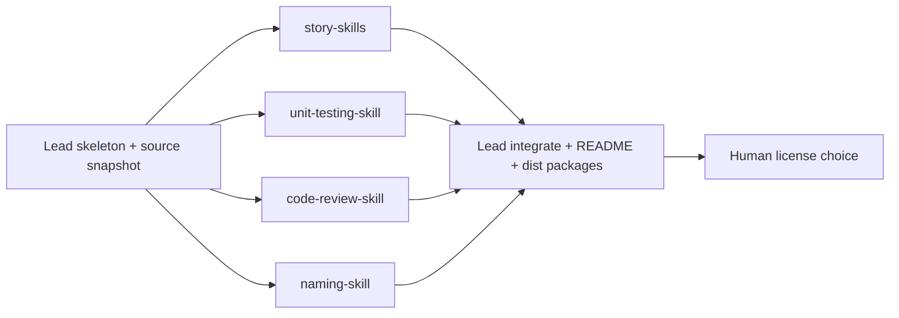

# otter-skills: consolidate and package agent skills

## Problem

Craft skills are scattered across `~/.agents/skills`, `~/Projects/otter-skill`, `~/Projects/tdd-skill`, and `~/Projects/naming_shortguide`, with overlap and drift. Need a shareable GitHub-ready repo at `~/Projects/otter-skills` with four consolidated skill families, multi-tool install paths (Claude, Codex, Copilot), and a basic README. License choice is deferred until after content lands.

## Current state (sources of truth)

- Story splitting: newer progressive-admission skill at `~/.agents/skills/iterative-story-split` (+ `references/source-map.md`); companion formatter `~/.agents/skills/user-pov-sliced-stories`. Older listicle dump at `~/Projects/STORY_SPLITTING_SKILL.md` is lower priority.
- Testing: `~/.agents/skills/tdd` and fuller corpus in `~/Projects/tdd-skill`; quality/FIRST skill at `~/.agents/skills/unit_test_engineering`; **canonical TDD skill** at `~/Downloads/canonical-tdd-skill.md` (file title; frontmatter name is currently `split-tidy-ship` — contains Canon TDD / ZOMBIES ordering, Tidy First?, virtue-targeted refactor, and trunk-landing notes). Target merge name: **`unit_testing`**.
- Code review: packaged Codex skill `~/Projects/otter-skill/ottinger-code-review` (+ `.skill`); ZOM detector `~/.agents/skills/code-review-zom-drift`. Anchor: Eight Code Virtues draft (Working prime; Unique/Simple/Clear/Easy/Developed/Brief/Coherent peers + improvement test).
- Naming: manuscript under `~/Projects/naming_shortguide/manuscript/` (`introduction`, `the_point`, `nouns_and_verbs`, `context`, `familiarity`, `length`, `incrementalism`, `extraction`, `conclusion`, etc.). Target skill: **`code-object-naming`**.

## Target repo shape

```text
~/Projects/otter-skills/
  README.md
  LICENSE          # placeholder stub only; final choice after populate
  docs/PLAN.md
  skills/
    iterative-story-split/
    user-pov-sliced-stories/
    unit_testing/
    ottinger-code-review/
    code-object-naming/
  dist/            # generated .skill zip packages (optional CI later)
  vendor-sources/  # read-only snapshots while authoring
```

Each skill directory is tool-portable:

- Required: `SKILL.md` (YAML `name` + pushy `description` + body)
- Optional: `references/`, `scripts/`, `README.md` (skill-local)
- Codex: `agents/openai.yaml` (`display_name`, `short_description`, `default_prompt`, `allow_implicit_invocation`)
- Claude/Copilot: same `SKILL.md` tree; README documents copy/symlink into `~/.claude/skills`, `~/.codex/skills`, `~/.copilot/skills`, and repo-local `.claude/skills` / `.codex/skills` / `.copilot/skills` / `.agents/skills`

Keep packages lean: no eval workspaces, no full article dumps inside skills unless a short `references/` digest is needed. Point to Agile Otter / Industrial Logic / manuscript sources in README and skill Sources sections.

## Consolidation rules

1. **Recent wins**: when two skills conflict, prefer the newer progressive-admission / primary-splitter wording over old SPIDR-menu dumps.
2. **One concept, one skill**: merge duplicates rather than ship parallel near-duplicates.
3. **Cross-links only**: skills may name siblings; do not duplicate full workflows across skills.
4. **Canonical voice**: Tim Ottinger / Agile Otter / Industrial Logic framing; progressive admission for stories; FIRST + microtests + TDD hygiene for testing; Eight Virtues + improvement test + ZOM-as-Unique/Developed/Coherent detector for review; short-guide manuscript for naming.
5. **No license bikeshed in content PRs**: leave `LICENSE` as `TBD` stub and a README section "License (pending)".

## Proposed skill outcomes

### 1) `iterative-story-split` + `user-pov-sliced-stories`

- Keep **two** skills (different triggers/outputs), not one blob.
- Primary splitter = progressive admission (start closed → admit one → default reject).
- User-POV skill = formatter only; defers sequence choice to iterative-story-split.
- Fold useful listicle pointers into `references/` sparingly; do not resurrect full old story-splitting-skill body.

### 2) `unit_testing` (merge `tdd` + `unit_test_engineering` + canonical TDD)

- Single skill covering: Clean Start, red-green-refactor-integrate, microcommits/Save Your Game, FIRST microtests, structure-shy/LoD tests, high-fidelity rule, affordable feedback, anti cargo-cult TDD.
- **Also fold in from `~/Downloads/canonical-tdd-skill.md` (priority with other Ottinger/Beck sources):**
  - Canon TDD discipline: one failing test at a time; no batch-of-tests-then-fill-in.
  - **ZOMBIES** test ordering (Zero → One → Many/More complex; Boundary, Interface, Exception; Simple scenarios/solutions).
  - **Tidy First?** before each next test: First / After / Later / Never (make the change easy, then make the easy change) — as hygiene inside the microtest loop, not a separate shipping skill.
  - Refactor toward **named Eight Virtues** (Working non-negotiable; Unique/Simple/Clear/Easy/Developed/Coherent; Brief last), not vague cleanup.
  - Prefer mechanical rename/extract tools when available; model judges *what*, tools do *how*.
- **Do not** pull the whole `split-tidy-ship` skill into `unit_testing`: story-level INVEST/SPIDR Phase 1 belongs to story skills; trunk/feature-toggle/branch-by-abstraction Phase 5 is out of scope for this package unless a later skill is added. Extract only the TDD/microtest/tidy/ZOMBIES/virtue-refactor core.
- Explicitly: TDD is hygiene for safe change, not system QA; Timely not Thorough; test-after is not TDD.
- Distill from: `canonical-tdd-skill.md` + `~/.agents/skills/tdd` + `unit_test_engineering` + `~/Projects/tdd-skill` digests + Agile Otter FIRST/microtesting + IL TDD purposes/practices; drop bulky article dumps from the share package (link out).
- When sources conflict: prefer Ottinger/IL microtest+FIRST framing and canonical ZOMBIES/Tidy First/Canon-TDD test selection over generic unit-test checklists.

### 3) `ottinger-code-review` (absorb `code-review-zom-drift`)

- Keep name `ottinger-code-review` for continuity with existing Codex package.
- Body aligned to Eight Virtues draft: Working non-negotiable; others balanced; improvement test; representation lens.
- Integrate ZOM drift as a first-class review pass under Unique/Developed/Coherent (repeated stems, parallel branches, numbered twins, flag piles)—not a separate top-level skill in the share set.
- Preserve useful `references/` (virtues, naming hooks, architecture) if already strong; trim contradictions with the 2026 draft.

### 4) `code-object-naming`

- New skill distilled from `naming_shortguide/manuscript` MD chapters.
- Operational agent workflow: diagnose name, choose noun/verb roles, apply context/familiarity/length/incremental rename guidance, extraction moments.
- Do not paste the whole book; progressive disclosure via short `references/` chapter digests if needed.

## Lead work (orchestrator)

1. Create `~/Projects/otter-skills` git repo skeleton + README + LICENSE TBD + empty skill dirs. **(done)**
2. Copy baseline materials into skill sandboxes / `vendor-sources/` (not eval workspaces), **including** `~/Downloads/canonical-tdd-skill.md` for the unit-testing author.
3. Fan out four skill authors in parallel (non-overlapping dirs).
4. Lead integrates, packages `.skill` files into `dist/`, smoke-checks frontmatter, finalizes README install matrix.
5. Stop before license selection; present options (MIT, Apache-2.0, CC BY 4.0, etc.) for free+commercial use.

## Orchestration

- **Decision**: Use four parallel local child agents after skeleton exists—one skill family each—to cut wall-clock and avoid merge thrash on unrelated prose.
- **Dependencies and ordering**:
  1. Lead creates repo skeleton + copies source snapshots into `vendor-sources/` or skill sandboxes (read-only references).
  2. Fan-out four skill authors (no cross-edits).
  3. Fan-in: lead reviews consistency (frontmatter, cross-links, no license text fights), writes root README install section, builds `dist/*.skill`.
  4. Human license conversation last.
- **Launch config**: Local children; inherit default model; no remote harness unless approved later.
- **Child agents**:
  - **story-skills** — Harmonize `iterative-story-split` + `user-pov-sliced-stories` from `~/.agents/skills` (recent priority) + Agile Otter progressive admission / splitting listicle pointers. Owns only those two skill dirs. Output: complete skill trees + brief SOURCE_NOTES.md for lead.
  - **unit-testing-skill** — Merge `tdd` + `unit_test_engineering` + **`~/Downloads/canonical-tdd-skill.md`** (TDD/ZOMBIES/Tidy First/virtue-refactor core only; exclude story-split and trunk-ship phases) into `unit_testing` per Ottinger/IL testing corpus. Owns `skills/unit_testing` only. Output: SKILL.md + lean references + Codex `agents/openai.yaml`.
  - **code-review-skill** — Evolve `ottinger-code-review` with ZOM absorption and Eight Virtues draft alignment. Owns `skills/ottinger-code-review` only. Start from `~/Projects/otter-skill/ottinger-code-review`.
  - **naming-skill** — Author `code-object-naming` from `~/Projects/naming_shortguide/manuscript`. Owns `skills/code-object-naming` only.
- **Merge strategy**: Lead merges directories as-is (no overlapping paths). One branch `main` on otter-skills; children write directly into assigned `skills/<name>/` after skeleton. Prefer non-overlapping file ownership.



## Out of scope for this pass

- Publishing the GitHub remote (user can `gh repo create` after content review)
- Final LICENSE selection
- Re-running full skill eval harnesses (optional later)
- Syncing back into `~/.agents/skills` automatically (README can document optional install)

## Success criteria

- `~/Projects/otter-skills` exists with five skill folders (four families; story keeps two skills), root README with install for Claude/Codex/Copilot/Warp-global paths, and `dist/*.skill` packages.
- No duplicate competing story-split or dual TDD/unit-test top-level skills.
- ZOM guidance lives inside code review skill.
- Naming skill is manuscript-grounded and agent-operable.
- License explicitly pending.
